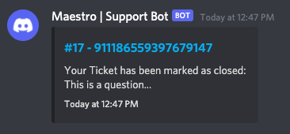

# Discord Support bot

## Workflow

There are 3 roles for the support system.

- Admins
- Experts
- Users

## Admins

Admins can issue commands below in **admin-bot** channel to do operations on experts.

| Commands                          | Description                                                                         |
|-----------------------------------|-------------------------------------------------------------------------------------|
| !listExperts                      | Lists all the experts                                                               |
| !addExpert @user :selected_emoji: | Adds an expert to the list. Used with 2 parameters. User and the selected emoji. |
| !removeExpert @user               | Removes an expert from the list. Used with 1 parameter. The user.                |

  
  

In order for an expert to be added to the list, first they need to be added to the **expert** role in the server.
After adding them, they need to be in the **admin-bot** channel to be added/removed to the expert
list.

## Experts

In the monitored channels (**test-bot** for our case), people can react to a message with a question mark emoji (❓) to mark it as a question.

The bot then sends the tagged message to our expert channel (**support-bot**).

This tagged message can also be viewed in the **Pinned Messages** until it's closed.

When an expert or admin wants to assign the ticket to an expert, all they have to do is react to that ticket with the expert's selected emoji.

Experts can view their assigned tickets in the private channel named after them at the end of discord channels.

When the title of the ticket is clicked, it navigates to the original message for the expert to answer.

When the expert and the user are happy with the question/answer, the ticket can be closed either
reacting the original message or the ticket in the expert channels with an exclamation mark emoji (❗)

  

When a ticket is closed, it's automatically removed from the **Pinned Messages**.

## Users

When a user's message is marked as a question (reacting to the message with ❓ emoji), they will get a DM from the bot about the created ticket.

Again when clicked on the title, it navigates to the original message.

After talking with expert about the question and the ticket is closed (reacting to the message with ❗), they will get a DM from the bot again about the closed status.

## Supported Channels

| **Channel Name**    | **Channel ID**         |
|-----------------|--------------------|
| smart-contracts | 737643344712171600 |
| wasmd           | 737640672680607764 |
| cosmjs          | 737640557400293416 |
| dapps           | 802118707639484416 |
